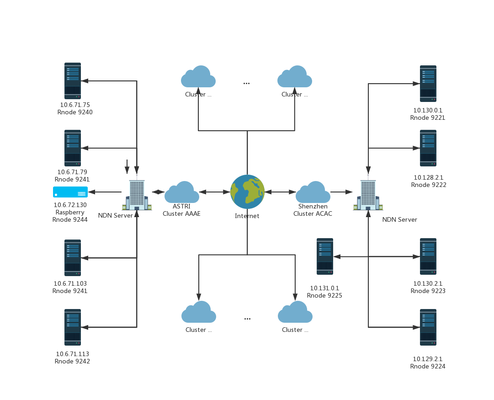

# NDN-AFS Project
##### Author: Vayne Tian
##### Date: 2019/08/15


## Installation
### Install Docker on Ubuntu
**follow https://docs.docker.com/install/linux/docker-ce/ubuntu/**

Update the apt package index:

`sudo apt-get update`

Install packages to allow apt to use a repository over HTTPS:
```
    sudo apt-get install \
    apt-transport-https \
    ca-certificates \
    curl \
    gnupg-agent \
    software-properties-common
```

Add Docker’s official GPG key:

`curl -fsSL https://download.docker.com/linux/ubuntu/gpg | sudo apt-key add -`

```
sudo add-apt-repository \
   "deb [arch=amd64] https://download.docker.com/linux/ubuntu \
   $(lsb_release -cs) \
   stable"
```

Update the apt package index.

`sudo apt-get update`

Install the latest version of Docker Engine - Community and containerd

`sudo apt-get install docker-ce docker-ce-cli containerd.io`

### Deploy docker container
**use docker image online from dockerhub**

`docker run -v /data/tmp/:/tmp -v /aos:/aos -it --privileged=true --name=ndn-astri-docker --network host -d vaynetian/ndn-astri-docker /bin/bash`

### Run the container
**run the container**

`docker exec -it ndn-astri-docker bash`

**start mongodb**

`mongdo &`

**start redis server**

`redis-server &`

**start server**

`screen npm run dev`

**start ndn**

`nfd &`

**config ndn route**

modify your cluster name in config

`vi config.json`

create faces and get nexthops(don't forget yourself as well)

*-using ip*

`nfdc face create udp4://xxx`

*-using ethernet*

`nfdc face create remote ether://[mac address] local dev://{your adapter name}`

add route 

`nfdc route add /chat/{your cluster name} nexthop`

*-example:*

`nfdc route add /chat/AAAA 266`

using multicast stragety

`nfdc strategy set prefix /chat/{your cluster name} strategy /localhost/nfd/strategy/multicast`

## Bootstrap yourself
**use local docker image through dockerfile**

`docker build -t ndn-docker .`

`docker run -v /data/tmp/:/tmp -v /aos:/aos -it --privileged=true --name=ndn-astri-docker --network host -d vaynetian/ndn-docker /bin/bash`

`docker exec -it ndn-astri-docker bash`

**install nodejs**
```
RUN wget -qO- https://raw.githubusercontent.com/creationix/nvm/v0.33.2/install.sh | bash \
    && source ~/.nvm/nvm.sh \
    && nvm install node \
    && nvm use node
```
**install mongodb**

`sudo apt-get update`

`apt-get install mongodb`

**install redis server**

`sudo apt-get update`

`apt-get install redis-server`

**start ndn**

`nfd &`

**config ndn route**

modify your cluster name in config

`vi config.json`

create faces and get nexthops(don't forget yourself as well)

*-using ip*

`nfdc face create udp4://xxx`

*-using ethernet*

`nfdc face create remote ether://[mac address] local dev://{your adapter name}`

add route 

`nfdc route add /chat/{your cluster name} nexthop`

*-example:*

`nfdc route add /chat/AAAA 266`

using multicast stragety

`nfdc strategy set prefix /chat/{your cluster name} strategy /localhost/nfd/strategy/multicast`

**get the repository**

`git clone ssh://git@10.6.126.115:6061/chainchat-server.git`

`npm i`

`npm run dev &`

## Overview
NDN-AFS Project aims at combining named-data networking and ASTRI blockchain file system, especially replacing Tn (tracking node in AFS) by NDN. At the moment, this system can successfully be installed on different systems, i.e. Centos, Ubuntu, and IOT devices like Raspberry Pi. In the future, the system will be the base of chainchat, a decentralized chat tool.

**AFS**

ASTRI File System is an advanced file system developed by ASTRI, which is based on blockchain technology. In AFS, a file is identified by an unique id called *afid*, and it's divided into 16 blocks stored on different Fn (file node in AFS). When fetching the file, any eight blocks of these can be used to recover the file on the Rn (retrieve node in AFS) and then we can check the md5 to verify the integrity of the file.

In a traditional way, a request for a file in AFS will first go find a Tn, which stores the File-Rn Table. In other words, through Tn can we get the Rn address of a file. However, several limits of Tn drive us to another solution. When a file is uploaded on the Un (upload node in AFS), there will be a few minutes' delay before the table is updated. Any request for this file at the moment will get the response like 'file not found'. To solve this, named-data networking is going to be introduced.

**NDN**

Named-data networking is a proposed Future Internet architecture inspired by years of empirical research into network usage and a growing awareness of unsolved problems in contemporary internet architectures like IP.

In NDN-AFS project, we use NDN primarily to replace tracking node whose function is mainly focused on searching the Rn where the searching target locates. We build the network among the Rns. Once the request arrives in the root node, it will be multicast to other rnodes according to the topology. Rn will find the file's information, includes whether the file exists, or recover and deliver the file back. In a wider range, a network among the root nodes and a http server is built. Send a request to global server and the interest will be mutlicast to the root nodes. Then the root nodes continuely deliver the interests and once get the result, i.e. expired time and cluster name, the data packet can be sent back using the former route.


